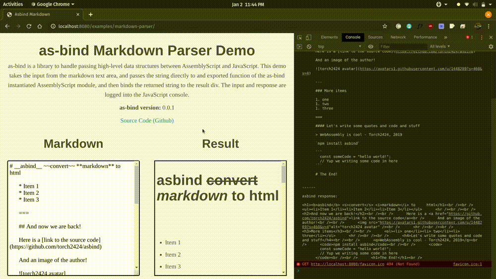

# as-bind

<!-- Badges -->

[](https://travis-ci.org/torch2424/as-bind)


Isomorphic library to handle passing high-level data structures between AssemblyScript and JavaScript. 🤝🚀

[Markdown Parser Demo](https://torch2424.github.io/as-bind/)



## Table of Contents

- [Features](#features)
- [Installation](#installation)
- [Quick Start](#quick-start)
- [Additional Examples](#additional-examples)
- [Supported Data Types](#supported-data-types)
- [Supported AssemblyScript Runtime Variants](#supported-assemblyscript-runtime-variants)
- [Reference API](#reference-api)
- [Motivation](#motivation)
- [Performance](#performance)
- [Production](#production)
- [Projects using as-bind](#projects-using-as-bind)
- [Contributing](#contributing)
- [License](#license)

## Features

- The library is isomorphic. Meaning it supports both the Browser, and Node! And has ESM, AMD, CommonJS, and IIFE bundles! 🌐
- Wraps around the [AssemblyScript Loader](https://github.com/AssemblyScript/assemblyscript/tree/master/lib/loader). The loader handles all the heavy-lifting of passing data into WebAssembly linear memory. 💪
- Wraps around imported JavaScript functions, and exported AssemblyScript functions of the AssemblyScript Wasm Module. This allows high-level data types to be passed directly to exported AssemblyScript functions! 🤯
- Moves a lot of work to compile-time using [AssemblyScript Transforms](https://www.assemblyscript.org/transforms.html#transforms) and completely avoids module-specific “glue code”. 🏃
- Installable from package managers (npm), with a modern JavaScript API syntax. 📦
- The library is [< 4KB (minified and gzip'd)](https://bundlephobia.com/result?p=as-bind), _including_ the AssemblyScript Loader ! 🌲
- This library is currently (as of January, 2020) the [wasm-bindgen](https://github.com/rustwasm/wasm-bindgen) of AssemblyScript. 😀

## Installation

You can install as-bind in your project by running the following:

`npm install --save as-bind`

## Quick Start

**1. Compiling your Assemblyscript**

To enable as-bind for your AssemblyScript Wasm modules, add the as-bind transform when compiling your module:

`asc your-entryfile.ts --exportRuntime --transform as-bind [...other cli options...]`

The things to notice are:

- `--transform as-bind` - This is the as-bind transform that runs at compile time. It embeds all the required type information into the WebAssembly Module.
- `--exportRuntime` - This is required for the AssemblyScript Loader to work properly. It [exposes functions](https://www.assemblyscript.org/garbage-collection.html#runtime-interface) on the module to allocate memory from JavaScript.

For **optional testing purposes** , let's export an example function we can try in `your-entryfile.ts`:

```typescript
export function myExportedFunctionThatTakesAString(value: string): string {
  return "AsBind: " + value;
}
```

**2. In your Javascript**

For **browser** JavaScript. We can do the following:

```javascript
// If you are using a Javascript bundler, use the ESM bundle with import syntax
import * as AsBind from "as-bind";

// If you are not using a bundler add a <script> tag to your HTML
// Where the `src` points to the iife bundle (as-bind.iife.js), for example: https://unpkg.com/as-bind
// Then, INSTEAD of using the import syntax, do: `const { AsBind } = AsBindIIFE;`

const wasm = fetch("./path-to-my-wasm.wasm");

const asyncTask = async () => {
  const asBindInstance = await AsBind.instantiate(wasm);

  // You can now use your wasm / as-bind instance!
  const response = asBindInstance.exports.myExportedFunctionThatTakesAString(
    "Hello World!"
  );
  console.log(response); // AsBind: Hello World!
};
asyncTask();
```

For **Node** JavaScript, we would use the CommonJS bundle by doing the following:

```javascript
// We need to import the direct as-bind.cjs.js for Node applications.
// This is because the default "main" key in the `package.json`,
// is the as-bind transform script
const AsBind = require("as-bind/dist/as-bind.cjs.js");

const fs = require("fs");

const wasm = fs.readFileSync("./path-to-my-wasm.wasm");

const asyncTask = async () => {
  const asBindInstance = await AsBind.instantiate(wasm);

  // You can now use your wasm / as-bind instance!
  const response = asBindInstance.exports.myExportedFunctionThatTakesAString(
    "Hello World!"
  );
  console.log(response); // AsBind: Hello World!
};
asyncTask();
```

## Additional Examples

## Passing a high-level type to a an exported function, and returning a high-level type

[See the Quick Start](#quick-start)

## Passing a high-level type to an imported function

In this example, we will implement a `console.log` that we can call from AssemblyScript!

**AssemblyScript**

Inside of `myWasmFileName.ts`:

```typescript
declare function consoleLog(message: string): void;

export function myExportedFunctionThatWillCallConsoleLog(): void {
  consoleLog("Hello from AS!");
}
```

**JavaScript**

```javascript
import { AsBind } from "as-bind";

const wasm = fetch("./path-to-my-wasm.wasm");

const asyncTask = async () => {
  // Instantiate the wasm file, and pass in our importObject
  const asBindInstance = await AsBind.instantiate(wasm, {
    myWasmFileName: {
      consoleLog: message => {
        console.log(message);
      }
    }
  });

  // Should call consoleLog, and log: "Hello from AS!"
  asBindInstance.exports.myExportedFunctionThatWillCallConsoleLog();
};
asyncTask();
```

## Supported Data Types

All primitive types, ie. Numbers (`u8`, `f32`, ...) , Strings, Typed Arrays (`Uint8Array`, `Float32Array`, ...) are supported. All of those types can also be used with `Array<T>`.

Custom classes are currently not support, but planned.

## Browser SDK

as-bind works with the Browser SDK. For a fully working example, see the [`browser-sdk` example](/torch2424/as-bind/tree/master/examples/browser-sdk).

## Reference API

### AsBind

The default exported ESM class of `as-bind`, also available as `import { AsBind } from "as-bind"` / `const { AsBind } = require('as-bind')`.

#### Class Properties

The `AsBind` class is meant to _vaguely_ act as the [WebAssembly](https://developer.mozilla.org/en-US/docs/WebAssembly) Object exposed to JavaScript environments.

##### version

`AsBind.version: string`

Value that is the current version of your imported AsBind.

##### instantiate

```typescript
AsBind.instantiate: (
  moduleOrBuffer: (
    WebAssembly.Module |
    BufferSource |
    Response |
    PromiseLike<WebAssembly.Module>
  ),
  imports?: WasmImports
) => Promise<AsBindInstance>`
```

This function is the equivalent to the [AssemblyScript Loader instantiate](https://github.com/AssemblyScript/assemblyscript/tree/master/lib/loader#api) function, which is similar to the [WebAssembly.instantiateStreaming](https://developer.mozilla.org/en-US/docs/Web/JavaScript/Reference/Global_objects/WebAssembly/instantiateStreaming) function. It essentially takes as its parameters:

- Any type of object that can be (resolved) and instantied into a WebAssembly instance. Which in our case would be an AsBindInstance.

- A [WebAssembly importObject](https://developer.mozilla.org/en-US/docs/Web/JavaScript/Reference/Global_objects/WebAssembly/instantiateStreaming), which would have all of your imported functions that can be called from within your AssemblyScript module.

##### instantiateSync

```typescript
AsBind.instantiateSync: (
  moduleOrBuffer: (
    WebAssembly.Module |
    BufferSource
  ),
  imports?: WasmImports
) => AsBindInstance`
```

This is a synchronous version of `AsBind.instantiate`. This does not accept a promise-like as its module, and returns an AsBindInstance instead of a Promise that resolves an AsBindInstance. **This is only reccomended for use in testing or development**. Please see the Documentation sections for `AsBind.instantiate` for more information.

#### Instance Properties

An AsBindInstance is vaguely similar to a [WebAssembly instance](https://developer.mozilla.org/en-US/docs/Web/JavaScript/Reference/Global_Objects/WebAssembly/Instance).

##### loadedModule

The raw, untouched instance of the WebAssembly Module.

##### exports

Similar to to [WebAssembly.Instance.prototype.exports](https://developer.mozilla.org/en-US/docs/Web/JavaScript/Reference/Global_Objects/WebAssembly/Instance/exports), this is an object containing all of the exported fields from the WebAssembly module. However, **exported functions** are bound / wrapped in which they will handle passing the supported high-level data types to the exported AssemblyScript function.

##### importObject

Similar to to [WebAssembly.instantiateStreaming() importObject](https://developer.mozilla.org/en-US/docs/Web/JavaScript/Reference/Global_Objects/WebAssembly/instantiateStreaming), this is the augmented `importObject`. It’s based on the original that was passed to one of the instantiation functions, but functions have been wrapped to handle high-level types.

## Motivation

This library was inspired by several chats I had with some awesome buddies of mine in the WebAssembly Community:

- [Till Schneidereit](https://twitter.com/tschneidereit) and I had a chat about [WasmBoy](https://github.com/torch2424/wasmboy), and about how I had a really good experience writing the emulator, even though I had to do my own memory management. But they helped me realize, building something low level isn't that bad with manual memory management, but building something like a markdown parser would be very tedious since you have to manually write the string back and forth. Which then inspired this library, and its [markdown parser demo](https://torch2424.github.io/as-bind/).

- While I was building [WasmByExample](https://wasmbyexample.dev/?programmingLanguage=assemblyscript) I wanted to start building the "High Level Data Structures" section. I then realized how much work it would be to maintain code for passing data between WebAssembly Linear memory would be for each data type, and how much work it would be to created each individual example. Then, my buddy [Ashley Williams](https://twitter.com/ag_dubs) helped me realize, if your docs are becoming too complex, it may be a good idea to write a tool. That way you have less docs to write, and users will have an easier time using your stuff!

Thus, this library was made to help AssemblyScript/JavaScript users build awesome things! I also want to give a huge thanks to the [AssemblyScript team](https://github.com/AssemblyScript/meta) and community for the help they provided me. I'm super appreciative of you all! 😄🎉

(Also! Huge Shoutout to @surma for doing the awesome refactor to use AssemblyScript compiler transforms! 🙏)

## Performance

**TL;DR** This library should be pretty darn fast. 🤔

The transform embeds all the required type information of imported and exported functions into a custom section of the WebAssembly module. All the runtime does is utilize the AssemblyScript Loader to convert these types from JS to ASC and vice-versa. Apart from `Array<T>`, which needs to be handled recursively, the overhead is fairly static and minimal.

In the future, these types of high-level data passing tools might not be needed at all, as the [WebAssembly Inteface Types proposal](https://github.com/WebAssembly/interface-types/blob/master/proposals/interface-types/Explainer.md) aims to give WebAssembly an understanding of higher-level types.

## Projects using as-bind

- The as-bind example is a Markdown Parser, in which as-bind takes in a string, passes it to a rough markdown parser / compiler written in AssemblyScript, and returns a string. [(Live Demo)](https://torch2424.github.io/as-bind/), [(Source Code)](https://github.com/torch2424/as-bind/tree/master/examples/markdown-parser)

- [use-as-bind](https://github.com/tylervipond/use-as-bind) is a React hook for using as-bind with an as-bind enabled WASM source. It's goal is to provide a simple API for React users to add WASM to their apps. [(Live Demo)](https://tylervipond.github.io/use-as-bind/)

- [as-loader](https://github.com/piotr-oles/as-loader) is a [webpack](https://webpack.js.org/) loader for AssemblyScript with built-in as-bind support.

_If you're project is using as-bind, and you would like to be featured here. Please open a README with links to your project, and if appropriate, explaining how as-bind is being used._ 😊

## Contributing

Contributions are definitely welcome! Feel free to open a PR for small fixes such as typos and things. Larger fixes, or new features should start out as an issue for discussion, in which then a PR should be made. 🥳

This project will also adhere to the [AssemblyScript Code of Conduct](https://github.com/AssemblyScript/assemblyscript/blob/master/CODE_OF_CONDUCT.md).

## License

[MIT](https://oss.ninja/mit/torch2424). 📝
